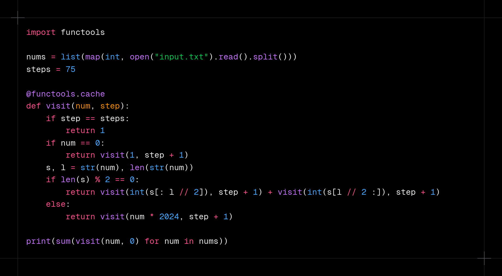

# Day 11

https://adventofcode.com/2024/day/11

## Data format

The input is a list of numbers.

## Approach

Brute force simulation fails for blinking 75 times so had to re-implement the code to memoize the calls for each stone.

### Part 1

> _How many stones will you have after blinking 25 times?_

1. Parse input and create a list of nums
2. Simulate blinking

### Part 2

> _How many stones would you have after blinking a total of 75 times?_

1. Parse input and create a list of nums
2. Implement a recursive version of blinking for one stone and memoize the function calls
3. Return sum of the return values for each stone

## Results

| Day | Time     | Rank | Score | Time     | Rank | Score |
| --- | -------- | ---- | ----- | -------- | ---- | ----- |
| 11  | 00:15:05 | 4098 | 0     | 00:32:14 | 2593 | 0     |
| 10  | 00:21:57 | 3393 | 0     | 00:23:19 | 2686 | 0     |
| 9   | 00:25:43 | 3000 | 0     | 00:55:45 | 2267 | 0     |
| 8   | 00:36:52 | 5055 | 0     | 00:40:25 | 3875 | 0     |
| 7   | 00:28:10 | 5063 | 0     | 00:30:24 | 3765 | 0     |
| 6   | 00:13:23 | 1919 | 0     | 01:15:57 | 5016 | 0     |
| 5   | 00:13:15 | 2188 | 0     | 00:40:50 | 4559 | 0     |
| 4   | 00:29:50 | 6150 | 0     | 00:42:39 | 5333 | 0     |
| 3   | 00:10:42 | 4551 | 0     | 00:32:56 | 6579 | 0     |
| 2   | 00:07:33 | 1459 | 0     | 01:00:47 | 8598 | 0     |
| 1   | 00:02:13 | 395  | 0     | 00:04:05 | 453  | 0     |

## Media

