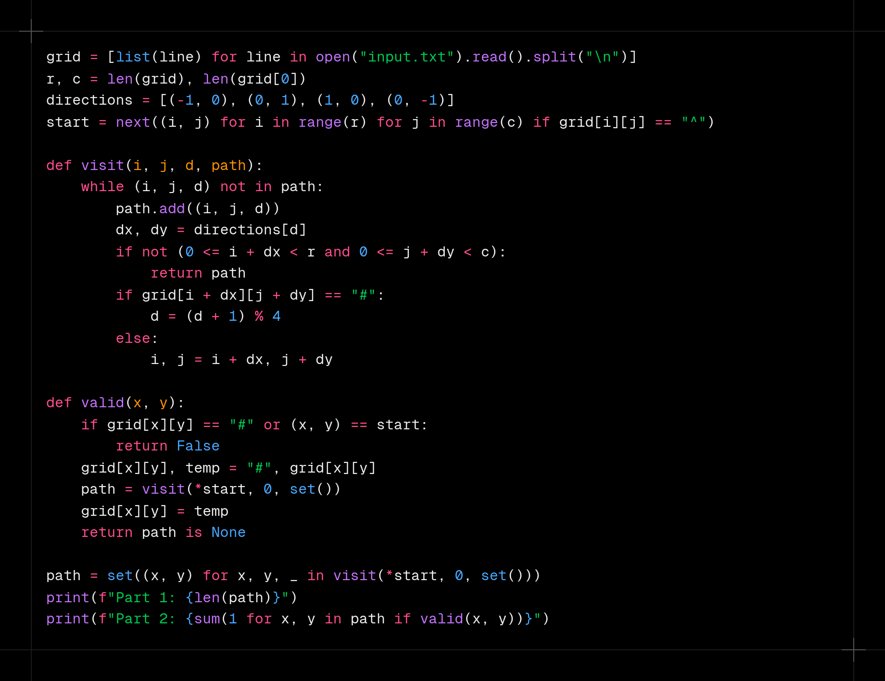

# Day 6

https://adventofcode.com/2024/day/6

## Data format

The input is a grid containing chars.

## Approach

### Part 1

> _How many distinct positions will the guard visit before leaving the mapped area?_

1. Find the start pos
2. Do a normal walk based on the rule
3. Create a set of visited pos and return length

### Part 2

> _How many different positions could you choose for this obstruction?_

1. Find the start posPlace a obstacle on possible positions
2. Place a obstacle on possible positions
3. Do walk and check if a position is visited again with same heading: (x, y, direction) for cycles
4. Return count of valid obstacles

## Results

| Day | Time     | Rank | Score | Time     | Rank | Score |
| --- | -------- | ---- | ----- | -------- | ---- | ----- |
| 6   | 00:13:23 | 1919 | 0     | 01:15:57 | 5016 | 0     |
| 5   | 00:13:15 | 2188 | 0     | 00:40:50 | 4559 | 0     |
| 4   | 00:29:50 | 6150 | 0     | 00:42:39 | 5333 | 0     |
| 3   | 00:10:42 | 4551 | 0     | 00:32:56 | 6579 | 0     |
| 2   | 00:07:33 | 1459 | 0     | 01:00:47 | 8598 | 0     |
| 1   | 00:02:13 | 395  | 0     | 00:04:05 | 453  | 0     |

## Media

