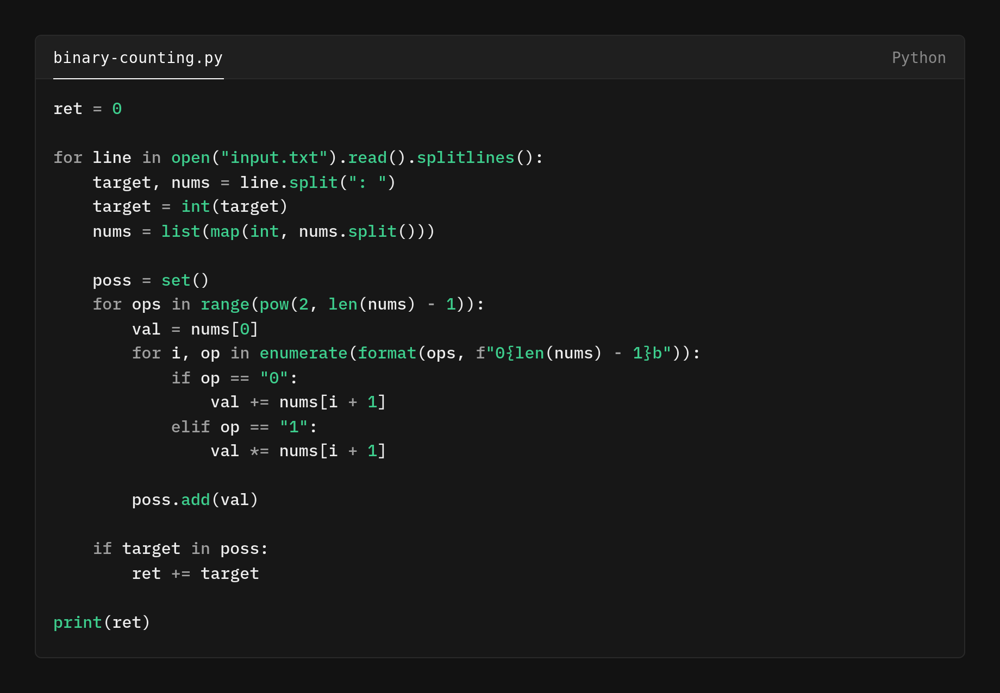
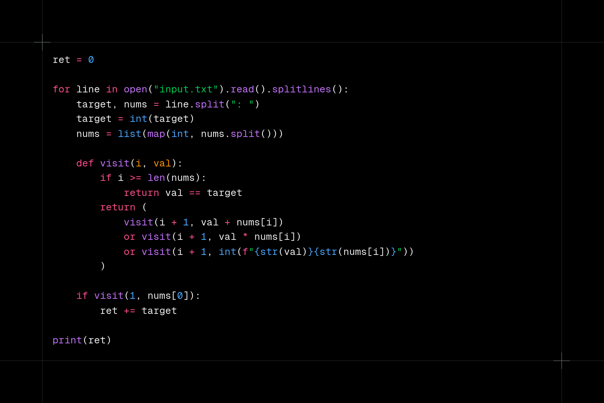

# Day 7

https://adventofcode.com/2024/day/7

## Data format

The input is a line containing target and numbers.

## Approach

Possible approaches:

1. Recursive
2. Iterative using `itertools.product(*iterables, repeat=1)`
3. Binary counting
4. Generating expressions and evaluating using `eval()`

### Part 1

> _What is their total calibration result?_

1. Parse a line
2. Visit all possible scenarios recursively
3. Sum the valid targets

### Part 2

> _How many different positions could you choose for this obstruction?_

Same as 1 just add an extra scenario

## Results

| Day | Time     | Rank | Score | Time     | Rank | Score |
| --- | -------- | ---- | ----- | -------- | ---- | ----- |
| 7   | 00:28:10 | 5063 | 0     | 00:30:24 | 3765 | 0     |
| 6   | 00:13:23 | 1919 | 0     | 01:15:57 | 5016 | 0     |
| 5   | 00:13:15 | 2188 | 0     | 00:40:50 | 4559 | 0     |
| 4   | 00:29:50 | 6150 | 0     | 00:42:39 | 5333 | 0     |
| 3   | 00:10:42 | 4551 | 0     | 00:32:56 | 6579 | 0     |
| 2   | 00:07:33 | 1459 | 0     | 01:00:47 | 8598 | 0     |
| 1   | 00:02:13 | 395  | 0     | 00:04:05 | 453  | 0     |

## Media

### Using binary counting for Part 1

### For Part 1 just remove the third scenario

