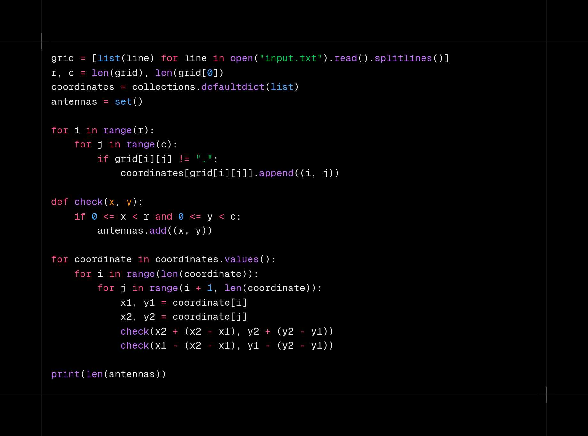
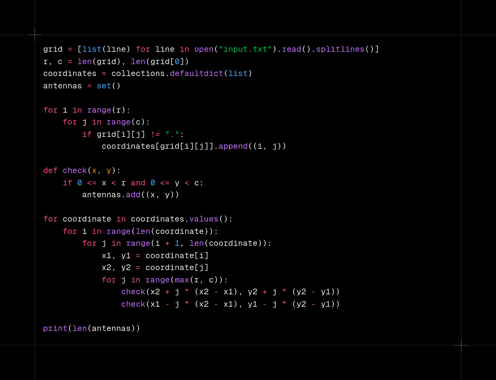
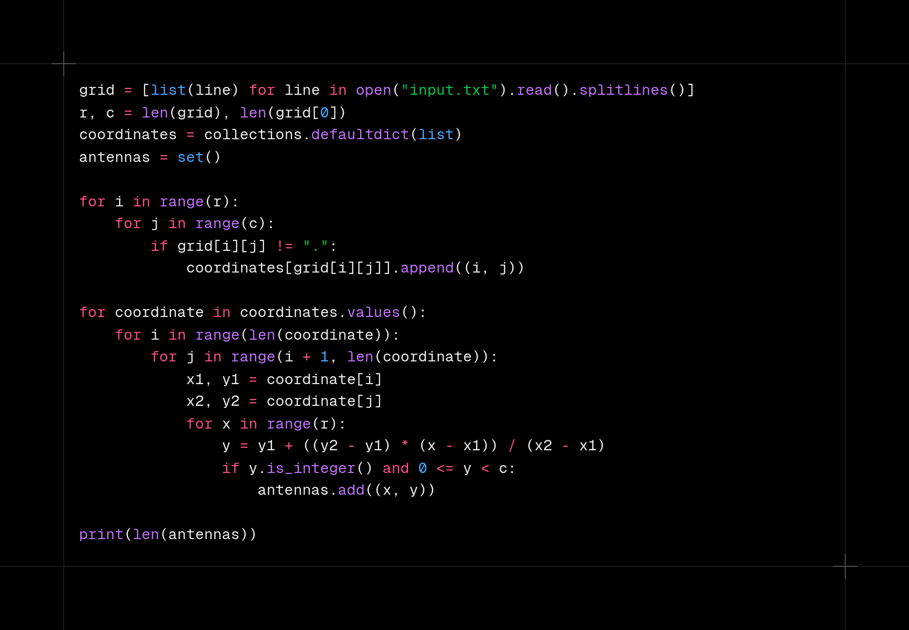

# Day 8

https://adventofcode.com/2024/day/8

Easy problem but took more time than expected due to a variable conflict which was found during debugging.

## Data format

The input is a grid containing positions of antennas.

## Approach

### Part 1

> _How many unique locations within the bounds of the map contain an antinode?_

1. Parse the input and find coordinates of antennas
2. For each pair of antennas find the possible anti-node positions(2 for each pair)
3. Check if the anti-node position lies in the grid

### Part 2

> _How many unique locations within the bounds of the map contain an antinode?_

1. Same as part 1
2. For each pair of antennas find all possible points which lie on the same line
3. Check if that point lies in the grid

Part 2 had weak test cases, the corrected code is in `b2.py`.

## Results

| Day | Time     | Rank | Score | Time     | Rank | Score |
| --- | -------- | ---- | ----- | -------- | ---- | ----- |
| 8   | 00:36:52 | 5055 | 0     | 00:40:25 | 3875 | 0     |
| 7   | 00:28:10 | 5063 | 0     | 00:30:24 | 3765 | 0     |
| 6   | 00:13:23 | 1919 | 0     | 01:15:57 | 5016 | 0     |
| 5   | 00:13:15 | 2188 | 0     | 00:40:50 | 4559 | 0     |
| 4   | 00:29:50 | 6150 | 0     | 00:42:39 | 5333 | 0     |
| 3   | 00:10:42 | 4551 | 0     | 00:32:56 | 6579 | 0     |
| 2   | 00:07:33 | 1459 | 0     | 01:00:47 | 8598 | 0     |
| 1   | 00:02:13 | 395  | 0     | 00:04:05 | 453  | 0     |

## Media

### Part 1

### Part 2 (Weak testcases)

### Part 2 (Correct)

